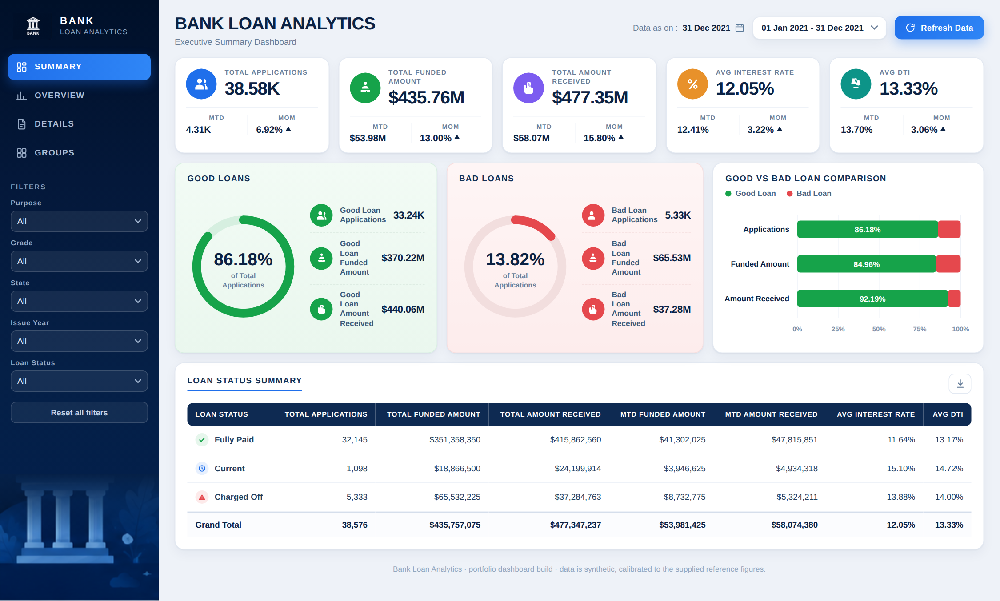
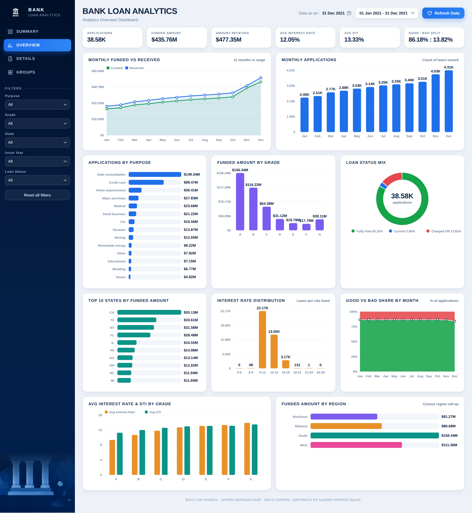
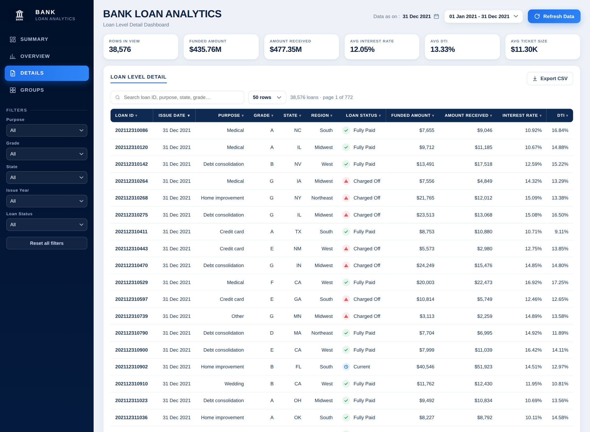
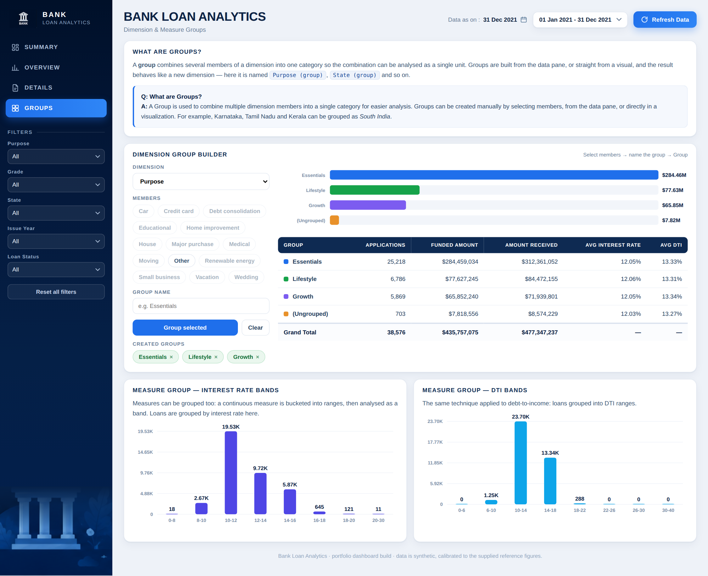

<div align="center">

# 🏦 Bank Loan Analytics — Executive Dashboard

**An interactive, single-file dashboard for monitoring loan portfolio performance, risk, and lending trends.**




</div>

---

## 📌 Overview

This project is an executive-level **loan analytics dashboard** that answers the questions a lending team asks every day:

- How many loans did we originate, and how much did we fund vs. collect?
- What share of the portfolio is **good** (Fully Paid / Current) vs. **bad** (Charged Off)?
- How do interest rate and DTI vary across grades, purposes, states and time?
- Which segments drive the most funded volume?

It runs entirely in the browser — **one HTML file, no build step, no server.**

## ✨ Features

| Area | What you get |
|---|---|
| **KPI cards** | Total Applications, Funded Amount, Amount Received, Avg Interest Rate, Avg DTI — each with **MTD** and **MoM** change |
| **Good vs Bad loans** | Donut gauges and a comparison bar for applications, funded amount and amount received |
| **Loan status summary** | Fully Paid / Current / Charged Off breakdown table with grand totals |
| **Global filters** | Purpose, Grade, State, Issue Year, Loan Status — every view updates instantly |
| **Overview charts** | Monthly funded vs received, monthly applications, purpose, grade, state, region, interest-rate distribution, good/bad share by month |
| **Loan-level details** | Searchable, sortable, paginated table of every loan with **CSV export** |
| **Groups** | Build custom dimension groups (e.g. combine purposes into *Essentials / Lifestyle / Growth*) and analyse interest-rate & DTI **measure bands** |

## 🖼️ Screenshots

### Summary
KPIs, good-vs-bad split, and loan status table at a glance.


### Overview
Trends and breakdowns across time, purpose, grade, geography and interest rate.



### Loan-Level Details
Search, sort, paginate and export individual loan records.



### Groups — Dimension & Measure Grouping
Create custom groups and analyse them side by side.



## 🔑 Headline Results (Dec 2021 snapshot)

| Metric | Value |
|---|---|
| Total loan applications | **38.58K** |
| Total funded amount | **$435.76M** |
| Total amount received | **$477.35M** |
| Average interest rate | **12.05%** |
| Average DTI | **13.33%** |
| Good loans (share of applications) | **86.18%** |
| Bad loans (share of applications) | **13.82%** |

**Takeaways**
- Debt consolidation and credit card are the largest funding purposes (~$149M and ~$99M).
- Grade A and B loans carry the most funded volume; average interest rate rises steadily from grade A to G.
- California, Texas and New York lead by state funded amount.
- Amount received exceeds funded amount overall, driven by interest on Fully Paid loans.

## 🚀 Getting Started

**Option 1 — open locally**
```bash
git clone https://github.com/<your-username>/bank-loan-analytics-dashboard.git
cd bank-loan-analytics-dashboard
open index.html      # macOS  (use `start index.html` on Windows, `xdg-open` on Linux)
```

**Option 2 — GitHub Pages (live demo)**
1. Go to **Settings → Pages**
2. Set source to **Deploy from a branch → `main` → `/ (root)`**
3. Your dashboard will be live at `https://<your-username>.github.io/bank-loan-analytics-dashboard/`

## 🗂️ Repository Structure

```
├── index.html        # the complete dashboard (HTML + CSS + JS + data)
├── screenshots/      # images used in this README
├── README.md
├── LICENSE
└── .gitignore
```

## 🛠️ Tech Stack

- **HTML5 / CSS3** — responsive layout, custom design tokens
- **Vanilla JavaScript** — filtering, sorting, pagination, grouping logic
- **Inline SVG** — hand-built charts (donuts, bars, lines, areas)
- Self-contained: no external runtime dependencies

## 📝 Data Note

The dataset embedded in this dashboard is **synthetic**, calibrated to reference figures for a bank-loan portfolio. It is intended for demonstration and portfolio purposes and does not represent real customers or a real institution.

## 📄 License

Released under the [MIT License](LICENSE).

---

<div align="center">
⭐ If you found this project useful, consider giving it a star!
</div>
